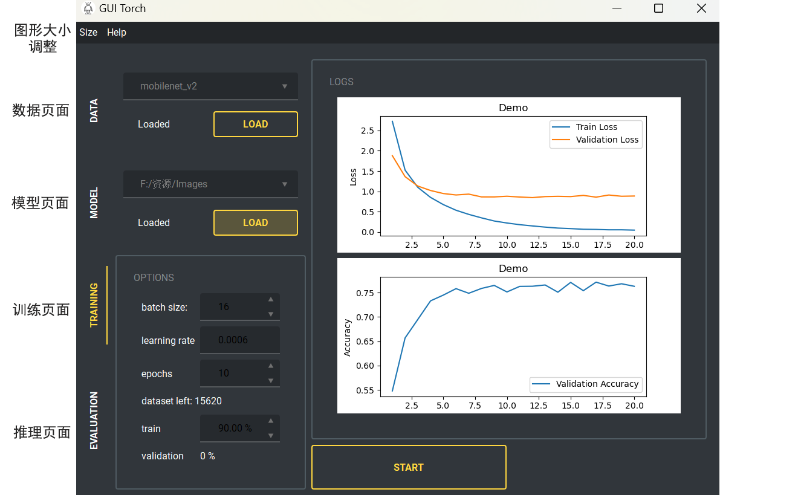
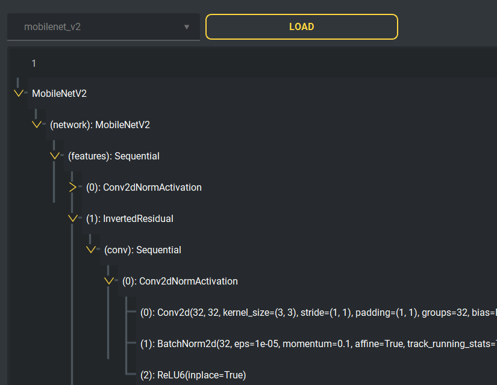
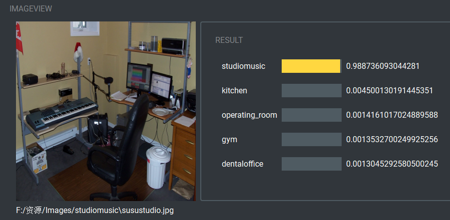

## GUI Torch

pytorch 模型训练和预测的界面展示。使用PyQt5实现，目前不具备通用性，仅能使用mobilenet等视觉模型，对一般的图像分类任务进行训练。由于GUI界面至支持在本地训模型，所以本地主机需要具备显卡，易用性不会超过浏览器页面。所以本项目仅提供一种UI展示，代码可直接获取。



- [x] 数据加载，预处理可视化
- [x] PyQt5 QTreeView 展示 Pytorch 模型的权重结构
- [x] 模型训练，损失值图片更新
- [x] 使用训练好的图像分类模型，对本地图像进行识别

## 1. 使用方法
```bash
$ python main.py  # 使用 python3 运行 main.py 文件
```
在数据页面中选择数据集目录后，即可直接到推理页面使用训练好的模型进行测试。默认模型使用 MobileNetV2，模型权重已包含在项目中。

## 2. 部分依赖环境
```bash
torch==1.7.0
torchvision==0.8.1
PyQt5
qt-material
```
缺少对应的库可以使用 pip install 包名==版本 进行安装，没有注明版本号即为默认版本

目前有个依赖问题，(PIL) pillow 自 9.2.0 版本开始 ImageQt 不再支持 PyQt5，如果要正常运行本项目，需要使用 9.2.0 以前的 pillow 库。
> https://pillow.readthedocs.io/en/stable/releasenotes/9.2.0.html#
> 
> Qt 5 reached end-of-life on 2020-12-08 for open-source users (and will reach EOL on 2023-12-08 for commercial licence holders).
> 
> Support for PyQt5 and PySide2 has been deprecated from ImageQt and will be removed in Pillow 10 (2023-07-01). Upgrade to PyQt6 or PySide6 instead.


## 3. 注意事项
本项目GUI界面包含模型训练功能，但不建议在没有显卡的个人电脑上训练模型。本项目的模型文件也是使用云平台的GPU进行训练的，预训练好的模型文件在 models 文件夹下。

## 4. 部分界面截图





本项目是广东财经大学深度学习与应用的课程设计。
